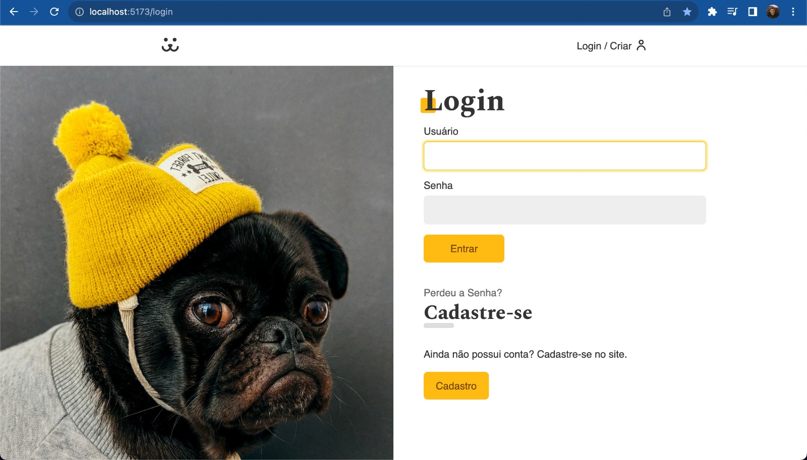
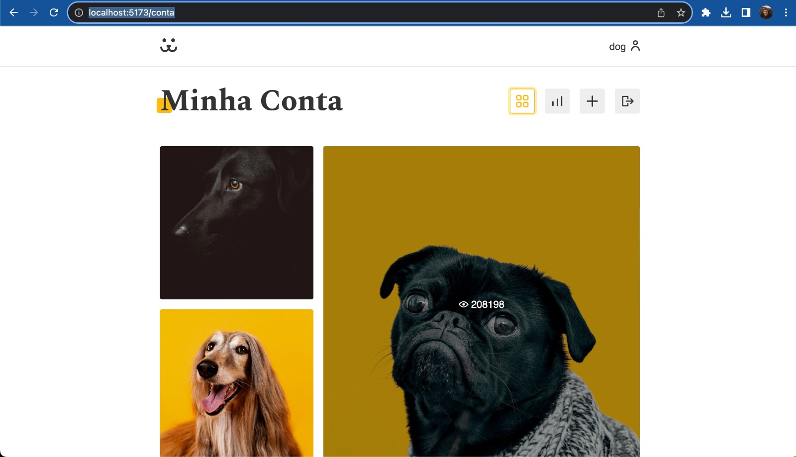
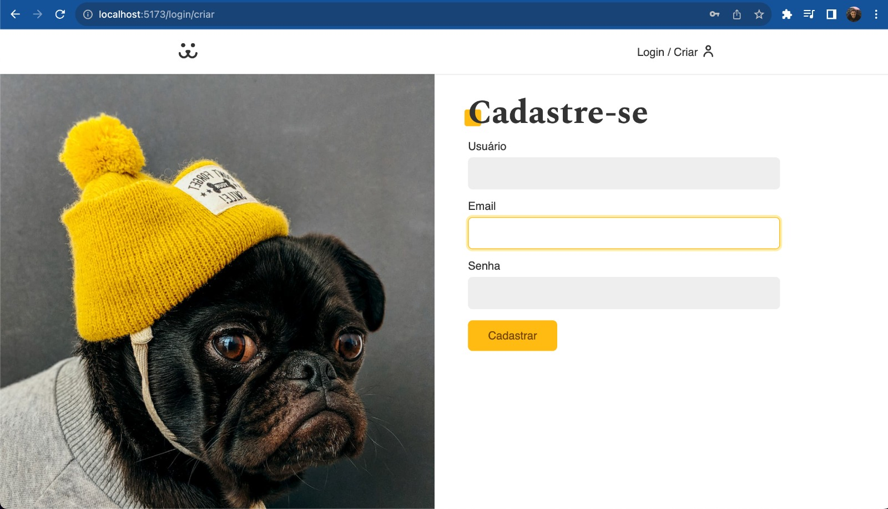
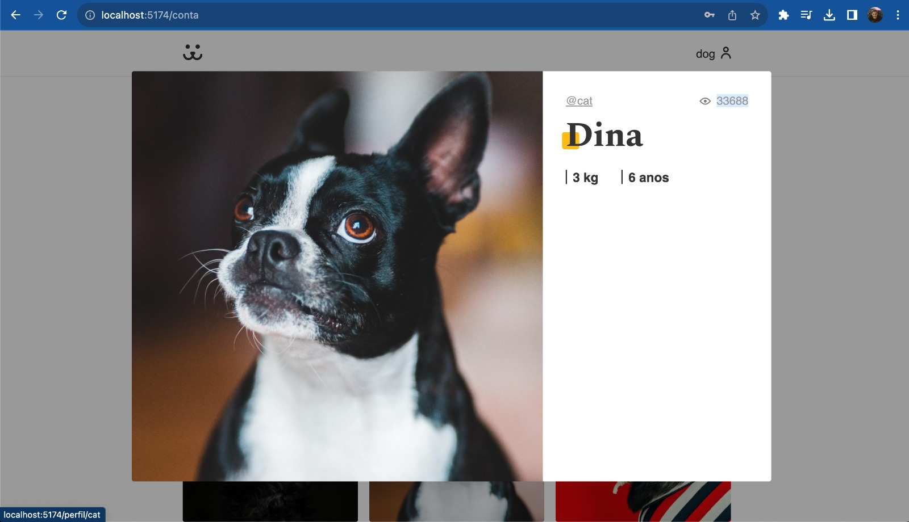
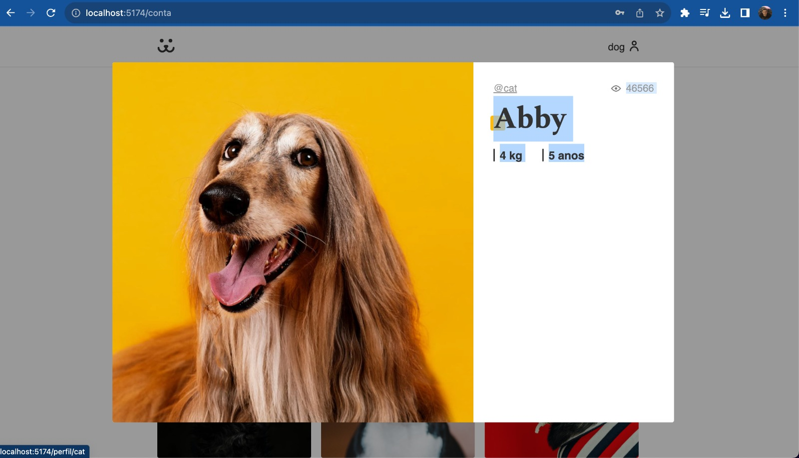

# Make for Dog

> This project is a website and social media platform designed for both humans and their furry companions. It provides various features, including an API, JWT authentication, infinite scrolling, integration with external libraries, build instructions, and loading capabilities.

https://github.com/eduardowanderleyde/dog-website/assets/103546791/c60c39de-1a64-4064-a0b6-6c75102300bf












## Development Setup
To set up a development environment for Make for Dog, follow these steps:

Clone the repository: git clone https://github.com/eduardowanderleyde/dog-website.git

Install development dependencies:
-First  download the NODE JS
-Put in the terminal:
```sh
npm install
```
-Run with:
```sh
npm run dev
```

Contributing

## Installation

To install Make for Dog on OS X & Linux, use the following command:

```sh
npm install dog-website --save
```
For Windows, you can configure it by editing autoexec.bat.

## Usage Example
Here are a few motivating examples of how Make for Dog can be used:

Share adorable pictures of your dog with the community.
Find dog-friendly places and events in your area.
Connect with fellow dog lovers and arrange playdates for your pets.
For more examples and detailed usage instructions, please refer to the Wiki.


Fork this repository (https://github.com/eduardowanderleyde/dog-website.git).
